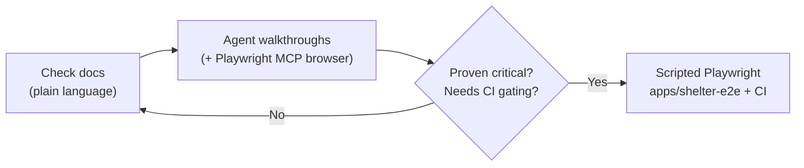

# Agent Browser Testing — Approaches, Findings & Next Steps

**Status:** review artifact. Merging the config requires no further decisions; this
doc exists so we can decide how far to take agent-assisted browser testing.

**Companion:** [`playwright_mcp.md`](./playwright_mcp.md) — setup and usage of the
Playwright MCP browser that `.vscode/mcp.json` provides.

## Why we're doing this

Verifying `shelter-web` changes currently means manually clicking through branch
previews and deployed environments. We want agent-assisted sanity checks that can
be run on demand — and, for a small set of critical checks, automatically per PR —
without hand-writing a brittle script for every flow.

## What we tried first (the walkthrough approach)

An agent walked through the `SDB-277/flag-to-perms-fe-ui` branch preview
(PR [#2468](https://github.com/BetterAngelsLA/monorepo/pull/2468)) using its
built-in page tooling, following a hand-written checklist.

| Checklist item           | Result                                                                                                                                                                              |
| ------------------------ | ----------------------------------------------------------------------------------------------------------------------------------------------------------------------------------- |
| Page renders             | ✅ `/`, `/search`, `/sign-in`, `/privacy-policy` all render                                                                                                                         |
| Header + links           | ⚠️ At the tool's narrow render width, desktop nav links were hidden (`hidden lg:flex`); the anonymous `LoginBanner` and hamburger had to stand in. Viewport couldn't be controlled. |
| Map                      | ✅ Rendered, centered on LA County (`34.04499,-118.251601`, z13); "Search this area" button present                                                                                 |
| Search control below map | ✅ "Search" button (navigates to `/search`) + filter button                                                                                                                         |
| Auto-fetch + empty state | ⚠️ Copy is state-dependent (detail below); "No results" / "Try searching for something else." rendered                                                                              |
| Sign-in page + form      | ✅ Renders with expected copy; disabled/enabled button logic had to be verified in code — the tool can't type                                                                       |
| Terms / Privacy links    | ✅ Both resolve → Termly-hosted pages with expected "TERMS OF SERVICE" / "PRIVACY POLICY" headings                                                                                  |

**Notable finding (worth a code fix).** The shelter results panel has two
"empty-ish" states that a first-time user passes through:

- **Pre-search** (query not yet run — the auto-search chain is
  geolocation (≤5s timeout → LA center fallback) → map idle → bounds search):
  `0 locations` + `(based on search area)` + **"No results / Try searching for
  something else."**
- **Post-search** (expected settled state): `0 of 0 locations` +
  `(based on map area)`.

So users briefly see an empty-state message implying a search happened when it
hasn't. A loading/skeleton state until the first search settles would remove the
ambiguity — and makes checks (human and automated) far simpler.

**Tooling gaps found** (not approach flaws): no viewport control, no
click/type, no console/network access, snapshot timing ambiguity. These are what
the Playwright MCP browser addresses.

## The three approaches

### A. Instructions-driven agent walkthroughs

Plain-language check docs (one per flow), written by UX and/or eng, executed by an
agent against a given base URL (branch preview, DEV, prod). The agent tolerates
cosmetic and **state** variance instead of asserting exact strings, and reports
`PASS / FAIL / UNVERIFIED` per item with evidence.

- **Strengths:** near-zero authoring cost; survives copy churn; interactive
  follow-ups; works against any environment instantly.
- **Limits:** agent judgment is nondeterministic; can't gate CI; needs
  state-aware writing (see the finding above).

### B. Agent with a real browser (Playwright MCP)

Adds a real Chromium to agent sessions: truthful viewports, accessibility-tree
snapshots, screenshots, clicks/typing, console/network. Turns approach A's
walkthroughs into genuinely interactive checks (desktop/mobile layouts, button
states, logged-in pages).

- **Strengths:** no app changes; unlocks every currently-blocked check.
- **Limits:** still agent-judgement (not a gate); token-heavy sessions.

→ See [`playwright_mcp.md`](./playwright_mcp.md) for setup and usage.

### C. Scripted Playwright in CI

Deterministic specs for must-not-break checks, run per PR against the branch
preview URL. Infrastructure pattern already exists
(`apps/betterangels-admin-e2e/playwright.config.ts` takes a `BASE_URL`; run the
existing preview deploy → test → PR comment loop).

- **Strengths:** deterministic, cheap to re-run, real merge-gate material.
- **Limits:** authoring/maintenance cost; needs `data-testid`s; every new flow
  is engineering work.

### How they compose



## Comparison tables

### Agent + instructions vs. scripted Playwright

|                                        | AI agent + instructions                              | Scripted Playwright                                                    |
| -------------------------------------- | ---------------------------------------------------- | ---------------------------------------------------------------------- |
| Authoring cost                         | ~0 — plain-language checklist                        | Engineering work per test                                              |
| Brittleness                            | Tolerant: explains state variants instead of failing | Exact assertions break on copy/state changes unless explicitly modeled |
| Interaction (typing, disabled→enabled) | ✅ With MCP browser                                  | ✅ Native                                                              |
| Viewport control                       | ✅ With MCP browser (none without)                   | ✅ Device profiles                                                     |
| Console / screenshots / traces         | ✅ With MCP browser                                  | ✅                                                                     |
| Run against preview/DEV/prod instantly | ✅                                                   | ⚠️ Needs `BASE_URL` wiring (pattern exists)                            |
| Determinism / CI gating                | ❌ Not suitable as a gate                            | ✅                                                                     |
| Interactive follow-ups                 | ✅                                                   | ❌                                                                     |
| Auth-gated flows                       | ⚠️ With a dev account + storage state                | ✅ via `storageState`                                                  |

### Options considered for reviewing md vs. lg layouts

| Option                                                    | Agent sees md/lg                                                                                 | Interaction | App changes           | Verdict                   |
| --------------------------------------------------------- | ------------------------------------------------------------------------------------------------ | ----------- | --------------------- | ------------------------- |
| Playwright MCP browser                                    | ✅ True viewport (media queries, a11y tree, screenshots)                                         | ✅          | None                  | **Adopted** (this branch) |
| Local screenshot script                                   | ⚠️ Pixels only                                                                                   | ❌          | None                  | Fallback option           |
| `?viewport=` container-width param                        | ❌ Media queries respond to the _viewport_, not container width — would misrepresent breakpoints | ❌          | Dev-gated CSS hacks   | Rejected                  |
| Iframe harness                                            | ⚠️ Wrapper layer; agent extraction unreliable                                                    | ❌          | Dev-only wrapper page | Rejected                  |
| Tailwind `@custom-variant` toggle (`data-force-viewport`) | ⚠️ Approximate (flips utility classes only — not `innerWidth`/scrollbars)                        | ❌          | Dev-gated CSS + POC   | Deferred                  |

### Costs

| Item                                                     | Cost                                                                                                                                        |
| -------------------------------------------------------- | ------------------------------------------------------------------------------------------------------------------------------------------- |
| MCP server, Playwright, Chromium                         | **$0** (open source); ~150 MB one-time browser download                                                                                     |
| Local compute                                            | Negligible (one headless Chromium per active session)                                                                                       |
| Model usage — Copilot path                               | Draws on the Copilot plan's AI credits (e.g. Business: 1,900 credits/user/month, pooled; overage $0.01/credit; code completions not billed) |
| Model usage — BYOK path (e.g. self-managed DeepSeek key) | Provider token pricing; works without a Copilot plan; the model config needs `toolCalling: true`                                            |
| Per-PR CI (scripted, public repo)                        | **$0** (free GitHub Actions minutes for public repos)                                                                                       |
| Agent-in-CI (optional, later)                            | Model tokens per run                                                                                                                        |

### Does any of this require GitHub Copilot?

| Layer                   | Requires Copilot? | Notes                                                                            |
| ----------------------- | ----------------- | -------------------------------------------------------------------------------- |
| Playwright MCP server   | No                | Free npm package; any MCP client can launch it                                   |
| MCP client / agent host | No                | Copilot Chat is one option; BYOK and other clients work too                      |
| Language model          | No                | Copilot models, or BYOK (e.g. DeepSeek via Custom Endpoint, `toolCalling: true`) |
| Billing                 | Either            | Copilot AI credits, or the provider's token bill                                 |

## Decisions so far

- ✅ **Adopt the Playwright MCP browser** as the interactive testing tool
  (`.vscode/mcp.json` on this branch; docs in this folder).
- ✅ **Add ~6 `data-testid`s** to make both agent and scripted checks stable:
  map "Search this area" button, results header, results-source line, empty-state
  block, "Search" button, sign-in form (label/input/submit), `LoginBanner`.
- ✅ **Fix the pre-search empty state** (skeleton or unify copy + count) — a UX
  improvement that also collapses the state matrix for checks.
- ✅ **DEV auth strategy:** seed a dev-only `@example.com` account (password mode,
  no email round trip; local dev already seeds `admin@example.com`/`password` via
  `accounts/signals.py`, `IS_LOCAL_DEV`-gated) and feed sessions to the agent via
  `--storage-state`. `+demo@` is environment routing, not a bypass — don't build
  on it.
- ✅ **CI plan:** graduate checks to scripted Playwright (`apps/shelter-e2e`,
  `BASE_URL` pattern from `apps/betterangels-admin-e2e`), run per PR, comment
  results on the PR.
- ❌ **Rejected:** container-width "viewport spoofing" (`?viewport=lg` → min-width
  tweak) — media queries don't respond to container width; it would show a
  misleading hybrid of breakpoints. (Verified: the shelter libs use no container
  queries and no `matchMedia`.) Also rejected: iframe harness.
- ⏸ **Deferred:** Tailwind `@custom-variant` OR-clause POC
  (`html[data-force-viewport=lg]`). If pursued: multiple clauses in one
  `@custom-variant` need verification, and gating must key off **deployment
  mode** — branch previews are production builds, so `import.meta.env.DEV` is
  `false` there.
- ⚠️ **Hygiene:** any viewport/debug affordance must be build-gated. The temporary
  debug classes in `libs/react/shelter/src/lib/layout/MainLayout.tsx`
  (`border-4 border-red-500`, `min-w-[2000px]`) must not merge.

## Proposed implementation plan

**Phase 0 — land the tooling (this branch).**
Land `.vscode/mcp.json` + this folder's docs. Trial run: one interactive
walkthrough of the SDB-277 preview (prompt starters in the companion doc).

**Phase 1 — code affordances (small eng).**
`data-testid`s; pre-search empty-state fix; seed the DEV `@example.com` account.

**Phase 2 — check docs (UX + eng).**
Convert the SDB-277 checklist into the first check doc using the template below.
Run on demand; iterate on false positives before automating anything.

**Phase 3 — CI (eng).**
`apps/shelter-e2e` smoke specs (home render; sign-in form enable/disable; empty
state) + a workflow that runs them against the branch preview after deploy and
comments results on the PR.

**Phase 4 — optional.**
`@custom-variant` POC; dev-container-level MCP provisioning; label-triggered
agent checks in CI (token cost, never a gate).

### Check doc template

```markdown
# Check: shelter-web — anonymous home page

- Target: `{baseUrl}` (branch preview, DEV, or prod — parameterized)
- Preconditions: anonymous session; declare geolocation state; no form submits
- Viewports: desktop 1440×900 · tablet 768×900 · phone 375×844

## Steps and expectations

1. Load `/` at desktop viewport
   - Header: logo "Shelter LA"; nav links: Home, About Us, Watch Video, Sign In
   - Anonymous banner: "Sign in with your Better Angels account to access privately shared shelters."
2. Map is visible; "Search this area" button appears once tiles settle
3. Below the map: a "Search" button and a filter button
4. Shelter results (may legitimately be empty in DEV):
   - Pre-search state may show `0 locations` / `(based on search area)`
   - Settled state after auto-search: `N of M locations` / `(based on map area)`
   - Empty results: "No results" / "Try searching for something else."
5. Click "Sign In" → `/sign-in`: Email Address input (`you@example.com`
   placeholder), Sign In button
   - Disabled for empty/invalid email; enabled for a valid non-`@example.com` email
   - `@example.com` switches to password mode
6. Terms of Service / Privacy Policy links open Termly-hosted policy pages
7. Report any console errors observed

## Out of scope

- Creating data (no form submissions), authenticated-only areas

## Feedback format

`PASS | FAIL | UNVERIFIED` per item + evidence (observed text/URL/screenshot) +
state caveats. Never fix code as part of a check run.
```

## Open questions for review

1. Which flows get per-PR coverage first (anonymous home vs. sign-in vs. the
   logged-in feature behind SDB-277)?
2. Who owns check docs, and at what cadence are they updated?
3. Budget guardrails for agent sessions — which model path (Copilot vs. BYOK) is
   the default for browser work?
4. Do we adopt any Phase 4 items now, or wait for Phase 2/3 signals?

## References

- [`playwright_mcp.md`](./playwright_mcp.md) — MCP browser setup & usage
- `.vscode/mcp.json` — committed server configuration
- `apps/shelter-web/src/assets/styles/global.css` — breakpoints (`sm` 375 / `md` 768 / `lg` 1152)
- `apps/betterangels-admin-e2e/playwright.config.ts` — CI pattern (`BASE_URL` override)
- `apps/shelter-e2e/` — scripted `shelter-web` specs (wired; sign-in + home page smoke specs landed)
- `libs/react/shelter/src/lib/components/SignIn/SignIn.tsx` — `@example.com` password mode
- `apps/betterangels-backend/accounts/signals.py` — local dev seeded accounts
- Playwright MCP — https://github.com/microsoft/playwright-mcp
