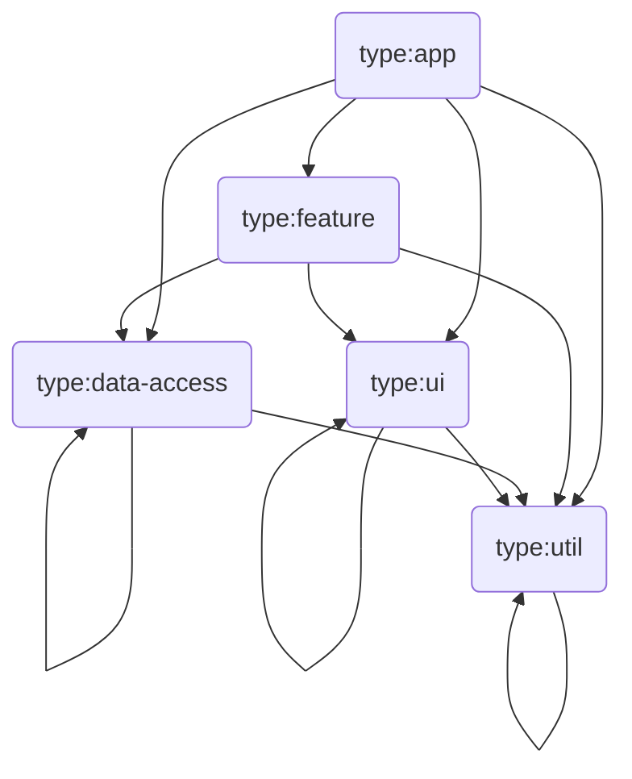

# NX Monorepo Style Guide

The BetterAngels monorepo is managed with [Nx](https://nx.dev), a build system
for monorepos. This guide documents our conventions for organizing projects,
tagging libraries, enforcing dependency boundaries, and making architectural
decisions. It follows NX's [official recommendations](https://nx.dev/docs/concepts/decisions/project-dependency-rules)
and patterns from the [nx-examples reference repo](https://github.com/nrwl/nx-examples).

---

## Core Concepts

### What is a "project"?

In NX, a **project** is any directory with a `project.json` — an app, a library,
an e2e test suite, or a tool. Projects are the unit of caching, affected
detection, and dependency enforcement.

From the [NX docs](https://nx.dev/docs/concepts/decisions/project-size):

> Moving code into projects can be done from a pure code organization
> perspective. Ease of re-use might emerge as a positive side effect. When
> organizing projects you should think about your **business domains**.

### Why split into libraries?

| Benefit                        | How                                                                            |
| ------------------------------ | ------------------------------------------------------------------------------ |
| **Faster CI**                  | `nx affected` skips unchanged projects; granular libs = smaller blast radius   |
| **Architecture visualization** | `nx graph` shows dependency relationships clearly                              |
| **Constraint enforcement**     | Tags + `enforce-module-boundaries` prevent incorrect imports                   |
| **API boundaries**             | Each library's `index.ts` is its public contract — internals stay encapsulated |
| **Code ownership**             | Directories map to teams; CODEOWNERS can be scoped per project                 |

From the [NX docs on code ownership](https://nx.dev/docs/concepts/decisions/code-ownership):

> If everyone can use and modify every piece of code, you can run into problems:
> another team adding complexity to satisfy their one use case, outside devs
> using internal code, or projects depending on the wrong libraries. These can
> all be enforced automatically using tags and the `enforce-module-boundaries`
> lint rule.

### What NX enforces vs. what's convention

NX the tool only cares about **three things**:

| NX enforces                          | How                                                           |
| ------------------------------------ | ------------------------------------------------------------- |
| `project.json` exists                | Makes it a project — unit of caching, affected, graph         |
| `tags` in `project.json`             | Used by `depConstraints` in ESLint to block incorrect imports |
| `depConstraints` in `.eslintrc.json` | Actually enforces the rules at lint time                      |

**Everything else is team convention** — folder names, folder nesting, scope
names, whether you put files under `src/lib/` or `src/`. NX doesn't care.
`nx graph` draws the same graph either way.

This guide documents our team's conventions. When in doubt about a folder
decision:

> "Tags are the architecture. Folders are for human navigation."

---

## Library Types

NX defines **4 primary library types** for categorizing code by _what it does_:

| Tag                | Purpose                                                                         | Can depend on                                              | Examples                                            |
| ------------------ | ------------------------------------------------------------------------------- | ---------------------------------------------------------- | --------------------------------------------------- |
| `type:feature`     | App-specific pages / business use cases (container components with data access) | `type:feature`, `type:data-access`, `type:ui`, `type:util` | `TeamsPage`, `DashboardPage`, `UserInviteForm`      |
| `type:data-access` | Backend interaction + state management (Apollo links, hooks, providers)         | `type:data-access`, `type:util`                            | `orgLink`, `useActiveOrgState`, `ActiveOrgProvider` |
| `type:ui`          | Presentational components only (no data fetching, no injected services)         | `type:ui`, `type:util`                                     | `Table`, `SearchInput`, `IconButton`                |
| `type:util`        | Framework-agnostic utilities, pure functions, types, constants                  | `type:util` only                                           | `mergeCss`, `toError`, date formatters              |

**The dependency flow is one-directional:**



Key rule: **`type:util` must never depend on framework-specific code** (React,
Apollo, etc.). If a "utility" imports from React, it's not `type:util`.

From the [NX docs](https://nx.dev/docs/concepts/decisions/project-dependency-rules):

> Keep the number of library types low. Clearly document what each type means.

---

## Scope Tags

While `type:*` describes _what kind_ of code a library contains, `scope:*`
describes _which domain_ it belongs to. This is NX's second tagging dimension.

| Tag                      | Domain                                                                                   | Rule                                                                        |
| ------------------------ | ---------------------------------------------------------------------------------------- | --------------------------------------------------------------------------- |
| `scope:shared`           | Generic code reusable across any project. No BA-specific logic, no backend conventions.  | Must never depend on domain-specific libraries                              |
| `scope:ba-platform`      | BA-specific platform glue shared across BA apps (org headers, permissions, storage keys) | Can depend on `scope:ba-platform`, `scope:shared`                           |
| `scope:ba-admin`         | BetterAngels admin portal                                                                | Can depend on `scope:ba-admin`, `scope:ba-platform`, `scope:shared`         |
| `scope:shelter-operator` | Shelter operator portal                                                                  | Can depend on `scope:shelter-operator`, `scope:ba-platform`, `scope:shared` |
| `scope:mobile`           | React Native (Expo) mobile app                                                           | Can depend on `scope:mobile`, `scope:ba-platform`, `scope:shared`           |

**The `scope:shared` isolation rule is critical.** If `libs/react/shared` (tagged
`scope:shared`) imports from `libs/ba-platform` (tagged `scope:ba-platform`),
the linter must reject it. This prevents the generic layer from becoming coupled
to BA-specific conventions.

From the [NX module boundaries blog post](https://nx.dev/blog/mastering-the-project-boundaries-in-nx):

> We don't want to allow a feature library used in Store to depend on the
> feature library from Admin and vice versa. Additionally, only our apps should
> be able to load the Core library.

---

## Folder Structure

### NX's recommended pattern

NX recommends grouping by **scope** first, then by **type**. From the
[NX folder structure docs](https://nx.dev/docs/concepts/decisions/folder-structure):

> Projects are often grouped by scope. A project's scope is either the
> application to which it belongs or a section within that application.

The official [nx-examples repo](https://github.com/nrwl/nx-examples) uses this
structure (with Nrwl Airlines as a fictional company):

```
apps/
├── booking/                     ← application
└── check-in/                    ← application

libs/
├── booking/                     ← scope:booking grouping folder
│   └── feature-shell/           ← type:feature project
├── check-in/                    ← scope:check-in grouping folder
│   └── feature-shell/           ← type:feature project
└── shared/                      ← scope:shared grouping folder
    ├── data-access/              ← type:data-access project (shared across apps)
    └── seatmap/                 ← scope:shared/seatmap nested grouping
        ├── data-access/          ← type:data-access project
        └── feature-seatmap/     ← type:feature project (shared feature)
```

Key patterns from the reference repo:

- **Scope folders contain type folders** — `libs/shared/product/data` (scope: `shared`, domain: `product`, type: `data`)
- **`+state` subdirectory** — state management code lives in `src/lib/+state/` within a data-access project
- **Barrel exports** — every project has `src/index.ts` as its public API
- **Framework-specific entry points** — e.g., `src/react.ts` for React-specific exports alongside framework-agnostic `src/index.ts`

### BetterAngels structure (current state)

This is what we have today. Projects live at the top level of `libs/`.
Tags define the architecture; folder moves are purely cosmetic.

```
apps/
├── betterangels/                ← React Native (Expo) mobile app
├── betterangels-admin/          ← React (Vite) admin portal
├── betterangels-backend/        ← Django + GraphQL backend
├── shelter-web/                 ← React (Vite) shelter portal
└── wildfires/                   ← Wildfires app

libs/
├── apollo/                      ← type:util, scope:shared
├── assets/                      ← type:util, scope:shared
├── ba-platform/                 ← type:data-access, scope:ba-platform
├── expo/                        ← type:feature, scope:mobile
├── python/                      ← type:util, scope:shared
├── react/
│   ├── betterangels-admin/      ← (to be tagged: type:feature, scope:ba-admin)
│   ├── components/              ← (to be tagged: type:ui, scope:shared)
│   ├── icons/                   ← (to be tagged: type:ui, scope:shared)
│   ├── shared/                  ← (to be tagged: type:util, scope:shared)
│   └── shelter-operator/        ← (to be tagged: type:feature, scope:shelter-operator)
├── shared/
│   ├── places/                  ← type:util, scope:shared
│   └── units/                   ← type:util, scope:shared
└── tailwind/                    ← type:util, scope:shared
```

> **Note:** Only `ba-platform` has been tagged so far (`type:data-access, scope:ba-platform`).
> Other projects use the default wildcard and will be tagged incrementally.
> Nesting into scope/type folders (e.g., `libs/shared/ui-components/`) is a future
> optimization — do it when a scope has multiple projects, not before.

### Tagging roadmap (incremental)

**Tags come first. Folders come later (if at all).** From the NX docs:

> Don't be too anxious about choosing the exact right folder structure from
> the beginning. Projects can be moved or renamed using
> `nx g @nx/workspace:move --project <old> <new>`.

Order of operations:

1. **Tag every project** — add `type:*` and `scope:*` to each `project.json`
2. **Add depConstraints** — enforce the rules once tags are in place
3. **Move folders (optional)** — only if a scope has multiple projects and nesting helps navigation

Tags to apply to existing projects:

| Current path                    | Type tag                   | Scope tag                   |
| ------------------------------- | -------------------------- | --------------------------- |
| `libs/ba-platform`              | `type:data-access` ✅ done | `scope:ba-platform` ✅ done |
| `libs/apollo`                   | `type:util`                | `scope:shared`              |
| `libs/assets`                   | `type:util`                | `scope:shared`              |
| `libs/tailwind`                 | `type:util`                | `scope:shared`              |
| `libs/react/components`         | `type:ui`                  | `scope:shared`              |
| `libs/react/icons`              | `type:ui`                  | `scope:shared`              |
| `libs/react/shared`             | `type:util`                | `scope:shared`              |
| `libs/shared/places`            | `type:util`                | `scope:shared`              |
| `libs/shared/units`             | `type:util`                | `scope:shared`              |
| `libs/react/betterangels-admin` | `type:feature`             | `scope:ba-admin`            |
| `libs/react/shelter-operator`   | `type:feature`             | `scope:shelter-operator`    |
| `libs/expo/*`                   | `type:feature`             | `scope:mobile`              |

---

## Dependency Constraints

Configured in `.eslintrc.json` via `@nx/enforce-module-boundaries`.

**Current state:** The repo uses a permissive wildcard (`*` → `*`).
This allows any project to import from any other project — no enforcement yet.

**Target state:** Once all projects are tagged, the following layered rules
should replace the wildcard:

```jsonc
{
  "@nx/enforce-module-boundaries": [
    "error",
    {
      "allow": [],
      "depConstraints": [
        // TYPE constraints (what kind of code)
        {
          "sourceTag": "type:feature",
          "onlyDependOnLibsWithTags": ["type:feature", "type:data-access", "type:ui", "type:util"]
        },
        {
          "sourceTag": "type:data-access",
          "onlyDependOnLibsWithTags": ["type:data-access", "type:util"]
        },
        {
          "sourceTag": "type:ui",
          "onlyDependOnLibsWithTags": ["type:ui", "type:util"]
        },
        {
          "sourceTag": "type:util",
          "onlyDependOnLibsWithTags": ["type:util"]
        },
        // SCOPE constraints (which domain)
        {
          "sourceTag": "scope:shared",
          "onlyDependOnLibsWithTags": ["scope:shared"]
        },
        {
          "sourceTag": "scope:ba-platform",
          "onlyDependOnLibsWithTags": ["scope:ba-platform", "scope:shared"]
        },
        {
          "sourceTag": "scope:ba-admin",
          "onlyDependOnLibsWithTags": ["scope:ba-admin", "scope:ba-platform", "scope:shared"]
        },
        {
          "sourceTag": "scope:shelter-operator",
          "onlyDependOnLibsWithTags": ["scope:shelter-operator", "scope:ba-platform", "scope:shared"]
        }
      ]
    }
  ]
}
```

Additional recommended flags from the [NX blog](https://nx.dev/blog/mastering-the-project-boundaries-in-nx):

- `"enforceBuildableLibDependency": true` — prevents importing non-buildable libs into buildable ones
- `"banTransitiveDependencies": true` — prevents importing transitive npm deps directly

---

## When to Create a New Library

From the [NX docs on project size](https://nx.dev/docs/concepts/decisions/project-size):

### Reasons to split

| Signal                                               | Action                                               |
| ---------------------------------------------------- | ---------------------------------------------------- |
| Two apps need the same behavior                      | Extract into a shared data-access or util library    |
| A library is importing from a domain it shouldn't    | Split or re-tag to enforce boundaries                |
| `nx affected` always tests too much code             | Split into smaller, independently cacheable projects |
| A component is used in 3+ places with the same props | Extract into a UI library                            |

### Reasons to keep together

| Signal                                              | Action                                                     |
| --------------------------------------------------- | ---------------------------------------------------------- |
| Code is still evolving rapidly                      | Keep in one project; refactor once stable                  |
| Splitting would create tiny single-file projects    | Keep consolidated; every project has config overhead       |
| Developers constantly jump between the two projects | They're likely too tightly coupled; keep together or merge |

> Every new project adds some folders and configuration files that are not
> directly contributing to business value. Nx helps reduce the cost, but it
> isn't zero.

---

## Adding a New Library

1. **Choose tags** — every library gets at least one `type:*` and one `scope:*` tag
2. **Add path alias** — register in `tsconfig.base.json` under `paths` as `@monorepo/<name>`
3. **Wire targets** — every library should have `lint` and preferably `test` in `project.json`
4. **Create barrel export** — `src/index.ts` is the public API; `src/lib/` is internal
5. **Keep it narrow** — a library should do one thing. If you have 5+ unrelated exports, consider splitting

### project.json template

```jsonc
{
  "name": "my-library",
  "$schema": "../../node_modules/nx/schemas/project-schema.json",
  "sourceRoot": "libs/my-library/src",
  "projectType": "library",
  "tags": ["type:data-access", "scope:ba-platform"],
  "namedInputs": {
    "default": ["{projectRoot}/**/*"]
  },
  "targets": {
    "lint": {
      "executor": "@nx/eslint:lint",
      "outputs": ["{options.outputFile}"]
    },
    "test": {
      "executor": "@nx/jest:jest",
      "outputs": ["{workspaceRoot}/coverage/{projectRoot}"],
      "options": {
        "jestConfig": "libs/<scope>/<type>/jest.config.ts"
      }
    }
  }
}
```

---

## Common NX Commands

```bash
# See the dependency graph
yarn nx graph

# Run targets only for affected projects
yarn nx affected -t lint
yarn nx affected -t test
yarn nx affected -t typecheck

# Run a target for a specific project
yarn nx test ba-platform
yarn nx lint betterangels-admin

# Run multiple projects
yarn nx run-many -t test -p ba-platform betterangels-admin

# Move/rename a project
yarn nx g @nx/workspace:move --project ba-platform ba-platform/data-access

# Remove a project
yarn nx g @nx/workspace:remove old-project

# Show project details
yarn nx show project ba-platform
```

---

## Code Ownership

As the monorepo grows, use [CODEOWNERS](https://docs.github.com/en/repositories/managing-your-repositorys-settings-and-features/customizing-your-repository/about-code-owners)
to assign responsibility:

```
/libs/ba-platform/    @betterangels/platform-team
/libs/shared/         @betterangels/platform-team
/libs/ba-admin/       @betterangels/admin-team
/libs/shelter-operator/ @betterangels/shelter-team
```

NX's [@nx/owners plugin](https://nx.dev/docs/reference/owners/overview) can
auto-generate CODEOWNERS from project tags.

---

## References

- [NX Project Dependency Rules](https://nx.dev/docs/concepts/decisions/project-dependency-rules)
- [NX Folder Structure](https://nx.dev/docs/concepts/decisions/folder-structure)
- [NX Module Boundaries (blog)](https://nx.dev/blog/mastering-the-project-boundaries-in-nx)
- [NX Project Size](https://nx.dev/docs/concepts/decisions/project-size)
- [NX Code Ownership](https://nx.dev/docs/concepts/decisions/code-ownership)
- [NX Dependency Management](https://nx.dev/docs/concepts/decisions/dependency-management)
- [nx-examples reference repo](https://github.com/nrwl/nx-examples)
- [Enterprise Angular Monorepo Patterns (book)](https://go.nx.dev/angular-enterprise-monorepo-patterns-new-book)
